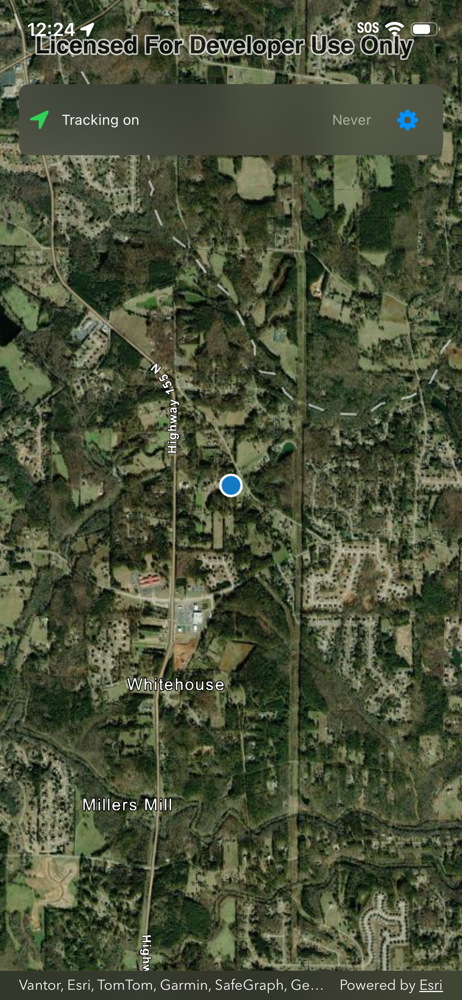
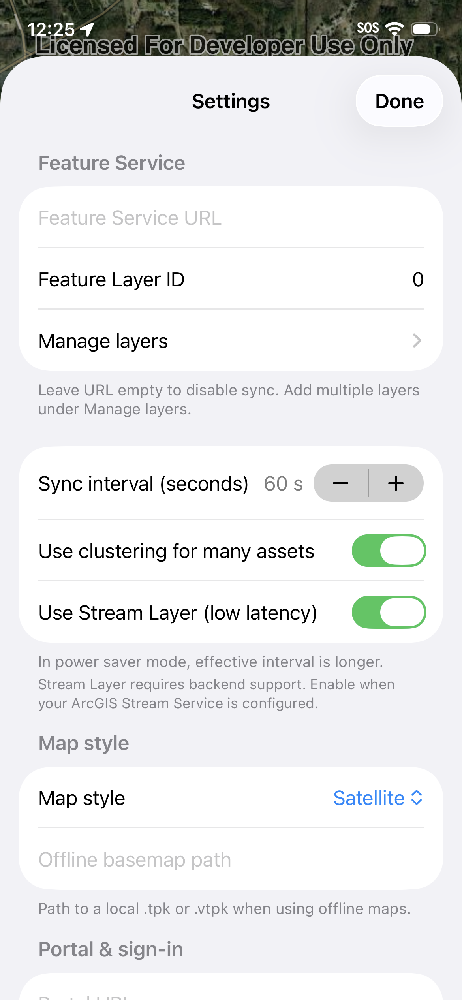
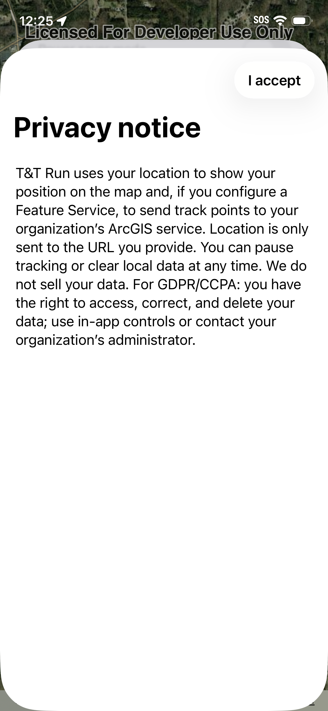
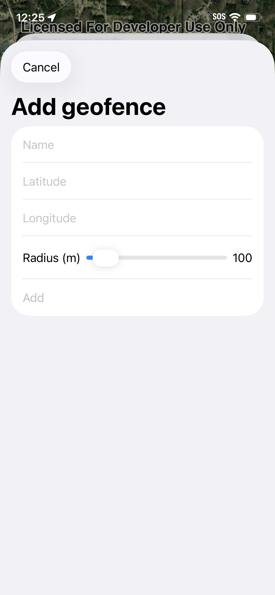

# T&T Run

Track & Trace for the field. A mobile app that shows your live position on a map and, optionally, syncs your location to an ArcGIS Feature Service for field and fleet use.

---

## What it does

- Live map — Your position on an interactive map with a choice of basemap styles.
- Optional sync — If you configure an ArcGIS Feature Service URL in the app, your location can be sent to that service at an interval you choose, so dispatchers or dashboards can see moving assets.
- No account required to use the map; sync is optional and configurable in Settings.

---

# Screenshots (4)

| Screenshot 1 | Screenshot 2 |
|:---:|:---:|
|  |  |

| Screenshot 3 | Screenshot 4 |
|:---:|:---:|
|  |  |

---

## Requirements

- iPhone or iPad (iOS 17 or later)
- ArcGIS API key (set by the developer; not entered by the end user in the app)
- Feature Service (optional) — Your or your organization’s ArcGIS Feature Service URL if you want to sync location data.

---

## License and use

This repository and all of its contents are proprietary. Use, duplication, distribution, modification, and all other uses are not permitted without prior written permission from the rights holder.

See [LICENSE](../LICENSE) for full terms.
